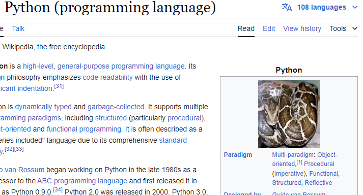

# ✈ mokr

Remote web browser automation.

## About

`mokr` is a spirtual successor to [`pyppeteer`](https://github.com/pyppeteer/pyppeteer),
which it was originally forked from. However, `mokr` isn't meant to be a 1:1 drop-in
replacement for it, and also doesn't seek to keep parity with
[`puppeteer`](https://github.com/puppeteer/puppeteer).

Some functionality has remained the same, but a lot has changed, too.
Some elements have been based off of `puppeteer`
proper and [`python-playwright`](https://github.com/microsoft/playwright-python), too.

`mokr` is named after [MOCR](https://en.wikipedia.org/wiki/Christopher_C._Kraft_Jr._Mission_Control_Center), Nasa's
Mission Operation Control Rooms that were used to control launches.

## Quickstart

Run `pip install mokr` to install package.

Run `mokr install` to install browsers.

Run `mokr scrape <url>` to load the target page and dump contents to console.

## Documentation

See the full [documentation](https://mokr.readthedocs.io/en/latest/index.html).

## Usage

Launch a headless browser, navigate to a site, and dump the html to console.
```python
import asyncio
from mokr import launch

async def main():
    async with launch() as browser:
        page = await browser.first_page()
        response = await page.goto("https://example.com")
        content = await response.content()
        print(content)
    
asyncio.run(main())
```

Launch a headful browser, hook some handlers to handle requests and responses,
and navigate to the Wikipedia page for Python. Use the handlers to intercept the
Python logo, make a new request for a picture of a python snake, and fulfill the
original request with it.
```python
import asyncio
from mokr import Request, Response, launch

async def main():
    snake_url = "https://upload.wikimedia.org/wikipedia/commons/3/32/Python_molurus_molurus_2.jpg"
    async with launch("chrome", headless=False) as browser:
        page = await browser.first_page()

        async def intercept_request(request: Request) -> Request | None:
            print(f"Intercepted request for: {request.url}")
            if request.url.endswith("Python-logo-notext.svg.png"):
                print("Getting a cute python picture to use as the new logo...")
                response = await page.fetch(snake_url)
                await request.fulfill(response)
            else:
                return request

        def log_response(response: Response) -> Request:
            print(f"Got {response.status} from: {response.url}")
        
        page.on("request", intercept_request)
        page.on("response", log_response)
        await page.goto("https://en.wikipedia.org/wiki/Python_(programming_language)")

asyncio.run(main())
```

Screenshot from running the above example.


`launch()` returns shared protocol interfaces, also exported from `mokr` for convenient annotations.
```python
from mokr import Browser, Page

async def inspect(page: Page) -> str:
    return await page.title()

async def first_page(browser: Browser) -> Page | None:
    return await browser.first_page()
```

However, if desired, direct objects could be imported from `mokr.cdp` or `mokr.bidi`.

## Notable Changes from Pyppeteer

While forked from `pyppeteer`, there are some notable changes beyond reformating,
refactoring, and restructuring! Including, but not limited to...

Changed:
  - The `NetworkManager` has been overhauled. The new Chrome implementation is based off of
  `puppeteer` heavily, but is not 1:1 with it. It uses the
  [fetch domain](https://chromedevtools.github.io/devtools-protocol/tot/Fetch/) instead
  of just the [network domain](https://chromedevtools.github.io/devtools-protocol/tot/Network/).
- Chrome request interception is enabled by default and can be disabled with
  `Page.set_request_interception_enabled(False)`. Firefox request interception is
  enabled when a `"request"` route is registered and disabled when all are de-registered.
  - `Browser.create` has been replaced with `Browser.ready` and accepts no keyword arguments.
  This means a `Browser` can be instantied and target discovery postponed until
  `.ready()` is called.
  - The `launch` method is top-level and offers an async context manager to better handle
  graceful exits.

New:
  - Firefox support.
  - Pages expose a backend-specific fetch domain through `Page.fetch_domain`
  and the convenient `Page.fetch` shortcut.
  - Another new class, `HttpDomain` is available to send ad hoc requests via an
  `httpx`, HTTP2-enabled, client that syncs it's cookies with the parent `Page` and
  vice-versa.
  - Proxy support is baked-in, meaning you can pass a `proxy` string to `mokr.launch` directly.
  - New `EventWaiter` class; based off of `pyppeteer.helper.waitForEvent` method.

Removed:
  - Tracing has been removed.
  - The legacy element-handle `querySelectorEval` and `querySelectorAllEval`
  helpers have been removed.

## Compared to...

Huge thanks are owed to the contributors of all the below projects, without them,
this project would be quite different.

The disadvantages below are not a knock on any of these projects or their contributors.

<table>
  <tbody>
    <tr>
      <th align="center">Package</th>
      <th align="center">Advantages</th>
      <th align="center">Disadvantages</th>
    </tr>
    <tr>
      <td><a href="https://github.com/microsoft/playwright-python">playwright-python</a></td>
      <td>
        <ul>
          <li>Well-maintained as owned by Microsoft.</li>
          <li>Offers syncronous and asyncronous APIs.</li>
          <li>Offers a fantastic request context.</li>
        </ul>
      </td>
      <td>
        <ul>
          <li>
            Can be difficult to debug in Python.
            <ul>
                <li>Remote calls are made to the local playwright server, not to the browser directly.</li>
                <li>APIs are generated, so digging into a method requires searching, or an actively running session, depending on your IDE.</li>
            </ul>
          </li>
          <li>Sync API is actually still running async code under-the-hood, which can lead to out-of-state browser pages and other unexpected behaviours.</li>
        </ul>
      </td>
    </tr>
    <tr>
      <td><a href="https://github.com/puppeteer/puppeteer">puppeteer</a></td>
      <td>
        <ul>
          <li>Well-maintained, easily the largest Node.js browser automation library.</li>
          <li>Working to support <a href="https://developer.chrome.com/blog/webdriver-bidi">BiDi</a>.</li>
        </ul>
      </td>
      <td>
        <ul>
          <li>Written in Node.js, does not mesh with a Python ecosystem.</li>
        </ul>
      </td>
    </tr>
    <tr>
      <td><a href="https://github.com/pyppeteer/pyppeteer">pyppeteer</a></td>
      <td>
        <ul>
          <li>Ported directly from puppeteer.</li>
        </ul>
      </td>
      <td>
        <ul>
          <li><b>No longer maintained!</b></li>
          <li>Does not use the fetch domain for request interception, resulting in unexpected behaviours with redirects in Chromium.</li>
          <li>Not "pythonic" in some ways, with a fair amount of duplicated code and camelCase variables (likely due to being a port).</li>
        </ul>
      </td>
    </tr>
  </tbody>
</table>

## To Do

- Explore decorating `Page.wait_for_<x>` methods with `contextlib.asynccontextmanager`
so the syntax is more straightforward.
